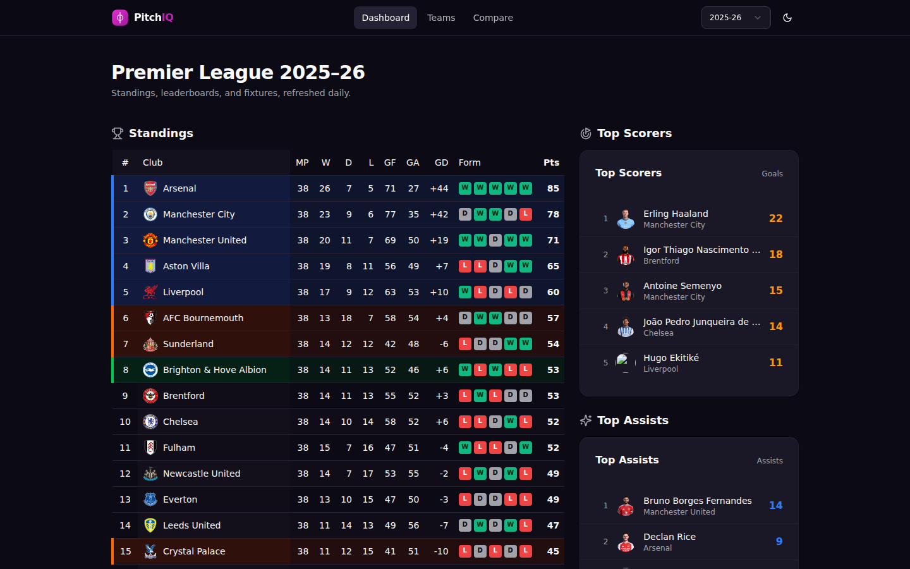
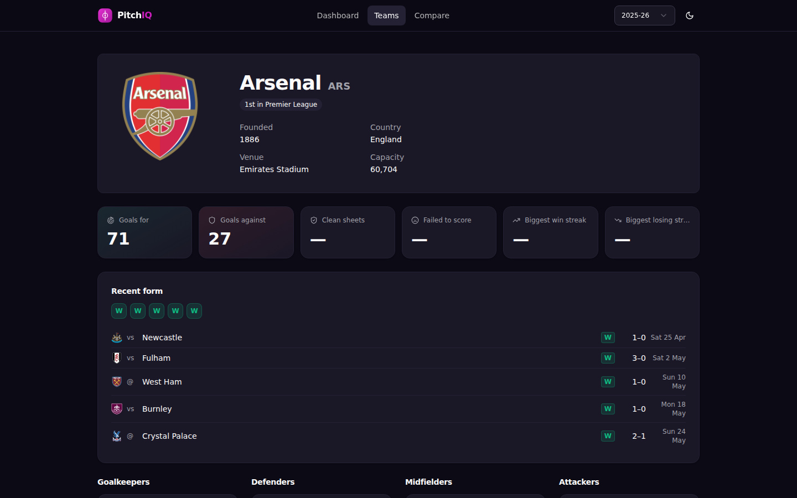
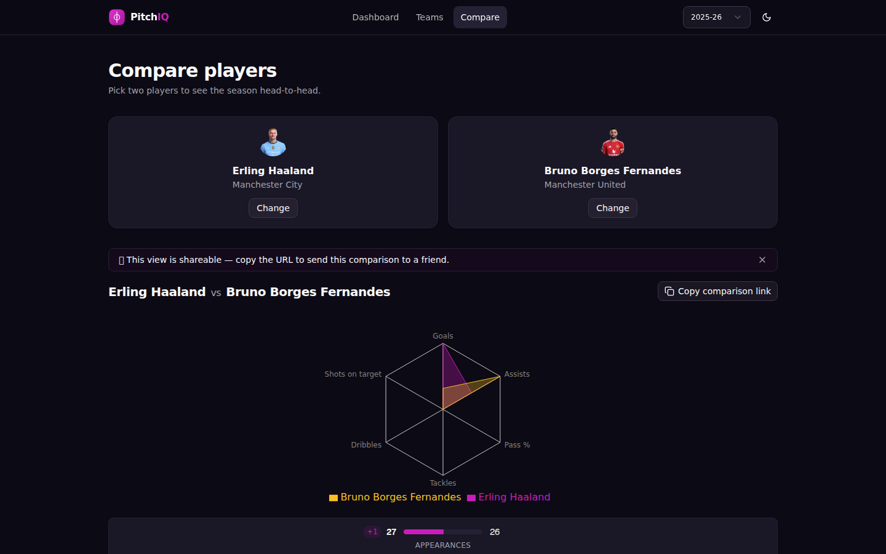

# PitchIQ — الدوري الإنجليزي الممتاز، بلغة البيانات

<p align="left"><a href="README.md">English</a> · <strong>العربية</strong></p>

<div dir="rtl">

تطبيق ويب فاخر قائم على البيانات وموسوعةٌ متخصّصة في الدوري الإنجليزي الممتاز. يقدّم **PitchIQ** بياناتٍ تاريخيةً شاملة، وتحديثاتِ المباريات، وملفّاتِ الأندية، ومحرّكَ مقارنةٍ متقدّمًا بين اللاعبين — بما في ذلك **المواجهات المباشرة عبر الحِقَب**: ابحث عن أي لاعبٍ من أي حقبة (منذ ١٩٩٢ وحتى اليوم) — بالاسم أو اللقب أو الأحرف الأولى (cr7، kdb) — واختر كلًّا منهما في أي موسم، أو مسيرته كاملةً عبر «كل المواسم». وتتضمّن المواسم الحديثة (٢٠١٧ حتى اليوم) **الأهداف المتوقعة (xG) والتمريرات الحاسمة المتوقعة (xA)** في ملفّات اللاعبين والمواجهات المباشرة.

</div>

<p align="center">
  
</p>

<p align="center">
  <a href="https://pitchiq-pl.vercel.app"><strong>▶&nbsp; العرض المباشر — pitchiq-pl.vercel.app</strong></a>
</p>



<div dir="rtl">

مبنيٌّ بمعماريةٍ بمستوى المؤسسات باستخدام **Next.js 15** و**React** و**TypeScript**، ويُبرز هذا المشروع ممارساتِ تطوير الواجهات الحديثة، بما فيها مزامنة بيانات خادم-عميل متينة، واستراتيجيات تخزين مؤقت متقدّمة، وتتبُّع حالةٍ شامل.

---

## ✨ ما الذي يجسّده PitchIQ

- **موجّه تطبيقات Next.js 15 الحديث** — مكوّنات الخادم، ومعالِجات المسارات (Route Handlers)، والبثّ التدفّقي عبر `<Suspense>`، والبيانات الوصفية القائمة على الملفّات (بطاقات `next/og` الديناميكية، وبيان تطبيق PWA، وأيقونة SVG).
- **طبقة بياناتٍ آمنة الأنواع** — كل قراءةٍ تُحلَّل ويُتحقَّق منها عبر **Zod**؛ ومعمارية لقطات JSON المُودَعة (دون قاعدة بيانات وقت التشغيل) تُبقي التطبيق سريعًا، ومجّانيَّ الاستضافة، وقابلًا للاختبار دون اتصال.
- **خطّ بياناتٍ آليّ** — خطٌّ **خارجي** يعيد بناء مجموعة البيانات يوميًّا، ويفتح **طلب دمجٍ تلقائيًّا (auto-PR)** إلى هذا المستودع عند أي تغيير. ويعرض التذييل ختمًا حيًّا **«حُدِّثت البيانات منذ كذا»** (من `data/_meta.json`) لإظهار وتيرة التحديث.
- **عمق البيانات** — **٣٤ موسمًا** (١٩٩٢-٩٣ → ٢٠٢٥-٢٦ — تاريخ الدوري الإنجليزي الممتاز كاملًا) مع **معرّفات لاعبين ثابتة عبر المواسم**، ونتائج الشوط الأول، والحُكّام، وحضور المباريات والملاعب، والشباك النظيفة والتصديات، وصفحة لوحات صدارةٍ مخصّصة، والأداء الأخير المُركَّب، و**تشكيلاتٍ أساسية حقيقية وأحداثِ مباريات** (أهداف/بطاقات/تبديلات) لكل موسم، و**إحصاءاتِ ولوحاتِ صدارة اللاعبين لكل موسم**.
- **محرّك «هل تعلم؟» القائم على حقائق قابلة للإثبات** — مكتبة قواعد حتمية (دون نماذج لغوية) تضمّ **٢٦ قاعدة** عبر نطاقات اللاعب والفريق والدوري، ولا تعرض إلا الحقائق التي يمكنها إعادة اشتقاقها من البيانات المُودَعة، ولكلٍّ منها دالّة تحقُّق `verify`. تشمل رؤى اللاعبين المُستخرَجة من الأحداث (الأندية التي سجّل في مرماها، الخصم المفضّل، الهاتريك)، وزوايا اللاعب لكل موسم (الأداء الزائد/الناقص مقابل xG، ومعدّل الشباك النظيفة، وأثر الانتقالات)، وأنماط الفرق (عدم الخسارة على أرضه، ومباريات القلب المتأخّر، ودوران المدرّبين، والهبوط والصعود المتكرّر)، وأرقام الدوري القياسية (أكبر الجماهير، وخطّ النجاة، ومواسم المئة نقطة، وقاهرو الكبار).
- **خريطة تاريخية تفاعلية** — صفحة `/map` تضع أندية الدوري الـ٥١ جميعها على **خريطةٍ دقيقة لإنجلترا وويلز** (حدود مناطق ONS حقيقية ومُسقَطة) مع **شريطٍ زمني ١٩٩٢→٢٠٢٥** يُضيء دوري الأضواء في كل موسم ويعيد كسوة الصفحة بحقبتها، إضافةً إلى نوافذ مناطق قابلة للنقر (الأندية + مجموع ألقاب الدوري).
- **هندسةٌ عالية الجودة** — **١١٧٠ اختبار وحدة/مكوّن** (Vitest، مع ٢ متخطّى، عبر ١٧٤ ملفًّا) + **٢٢ اختبار Playwright من طرفٍ إلى طرف** + تغطية **انحدارٍ بصري**، ومراقبةٌ عبر **Sentry**، وبوابات CI على كل طلب دمج.
- **نظام تصميم** — **Tailwind CSS v4** + **Shadcn UI**، ورموز ألوانٍ دلالية، وسمتان فاتحة/داكنة، وسمة «آلة الزمن» لكل حقبة، وتعريبٌ كامل **بالإنجليزية والعربية (من اليمين إلى اليسار)**.

## 📸 لقطات الشاشة

</div>

| ملف الفريق | مقارنة اللاعبين |
| --- | --- |
|  |  |

<div dir="rtl">

<details>
<summary><strong>📍 سجلّ البناء الكامل والحالة مرحلةً بمرحلة</strong> — انقر للتوسيع</summary>

## 📍 حالة المشروع — مكتمل 🎉

> **جميع المراحل الـ١٧ أُنجزت.** بات PitchIQ مكتمل الميزات: تاريخ الدوري كاملًا عبر **٣٤ موسمًا (١٩٩٢-٩٣ → ٢٠٢٥-٢٦)** متاحٌ مباشرةً مع موسم ٢٠٢٥-٢٦ افتراضيًّا، ومبادرة الواجهة اللاحقة للبيانات بأكملها — إعادة تصميمٍ شاملة، وتعريبٌ إنجليزي وعربي، وطبقةُ حركة — قد اكتملت.

**مسار البيانات (المراحل ٠–١٤)** بنى الموسوعة: الترتيب، والمباريات وتفاصيلها، وملفّات الأندية وقوائم اللاعبين، وملفّات اللاعبين، والمدرّبون، وأداة المقارنة موسمًا بموسم، ولوحات الصدارة، ومحرّك الطرائف، والخريطة التفاعلية — وكلّها مدعومةٌ ببيانات JSON مُودَعة تُحدَّث يوميًّا مع معرّفات لاعبين ثابتة عبر المواسم. ومن أبرز المحطّات على الطريق: **شعارات أندية دقيقة زمنيًّا** (محلِّلٌ لكل موسم يُظهر شعار كل نادٍ الصحيح لحقبته، بتغطية ٣٨ ناديًا)، و**هويّة اللاعب عبر المواسم** التي جرى تحصينها كي يحتفظ اللاعب العائد بمعرّفه وبتاريخه المتّصل (مع حارس CI ضدّ أي انفصالٍ مستقبلي)، و**تلوين التأهّل الأوروبي والهبوط** لكل موسمٍ مُتحقَّقٌ منه مقابل السجلّ التاريخي وبأسماء بطولاتٍ دقيقة لكل حقبة.

**المراحل ١٥–١٧ — مبادرة الواجهة اللاحقة للبيانات — مكتملة:**

- **المرحلة ١٥ · إعادة التصميم الشاملة** — أُعيد بناء كل صفحةٍ والهيكل المشترك (لوحة معلومات «بِنتو»، وفهرس فرقٍ بشبكة شعارات، وملفّات فرقٍ بشبكة إحصاءاتٍ حرارية، وملفّات لاعبين ومدرّبين بأسلوب «غلاف المجلّة»، ومواجهةٌ مباشرة محورها الرادار، وشبكةُ لوحات صدارةٍ بترتيب ميداليات، وخريطةٌ بأسلوب «الشاشة السينمائية»)، مع الحفاظ في كلٍّ منها على نظام حِقَب «آلة الزمن» عبر السمتين الفاتحة والداكنة وبتغطيةٍ متجاوبة كاملة — واختُتمت بشبكة انحدارٍ بصري موسّعة و[وثيقة نظام تصميم](docs/design-system.md) مكتوبة.
- **المرحلة ١٦ · التعريب** — **الإنجليزية والعربية بدعمٍ كامل للاتجاه من اليمين إلى اليسار** منذ اليوم الأول، عبر توجيه المسارات ببادئةٍ في next-intl (الإنجليزية في الجذر، والعربية تحت `/ar/*`)، ومسحٍ شاملٍ للخصائص المنطقية في التخطيط، وخطّ ويبٍ عربي، وصيغ جمعٍ من نوع ICU، وأرقامٍ عربية شرقية، وتنسيقٍ للتواريخ والأرقام حسب اللغة. كما أنّ **البيانات نفسها** تُقرأ بالعربية على `/ar` أيضًا — كل الأندية الـ٥١ (مع ملاعبها ومدنها)، والمدرّبون الـ٢٩٣، واللاعبون الـ٥١١٦، والمراكز، والجنسيات — مع خطوةٍ في المهمّة اليومية تُعرِّب الكيانات الجديدة تلقائيًّا. راجع [مسرد كرة القدم](docs/i18n-glossary.md).
- **المرحلة ١٧ · الحركة والرسوم المتحركة** — طبقةٌ هجينة من CSS + Motion: شاشةُ إقلاعٍ نيونية بأسلوب الألعاب، وانتقالات مساراتٍ بتلاشٍ وتكبير، وكشفٌ متدرّج عند التمرير، ولغةُ تفاعلٍ دقيقة بأسلوب «التوهّج النيوني». تحترم كل حركةٍ تفضيل `prefers-reduced-motion`، ولا يُحرّك أي إطارٍ مفتاحي خاصيةَ تخطيطٍ (مفروضٌ عبر CI)، ولا تُرسِل مكتبة الحركة **أي بايتٍ** إلى العميل.

**المرحلة ٠ — الأساسات:** ✅ **مكتملة — ٨/٨ تذاكر.** خطّ CI (`ci.yml` — فحص الأسلوب · فحص الأنواع · الاختبارات · البناء) إلى جانب مسار Playwright منفصل (`e2e.yml`) يعمل على كل طلب دمجٍ مع اعتراض MSW للطلبات الخارجية ورفع تقرير HTML عند الفشل (TASK-002)، وبنية تحتية لمُثبِّتات MSW مشتركة، وحارس حصّةٍ للطلبات الخارجية، ومذكّرة رجوعٍ للمواسم على مستوى العملية تُقلِّم الموسم المطلوب تلقائيًّا إلى أعلى قيمةٍ متاحة، وتتبُّع أخطاء Sentry في المتصفّح والخادم، ونقطة `GET /api/health` لقياس التشغيل (أُعيد تصميمها في TASK-510 لإظهار حداثة البيانات من `data/_meta.json`)، وقالب طلب دمجٍ منظَّم وإعداد Renovate لطلبات التبعيات الأسبوعية، وخطّاف Husky قبل الإيداع يشغّل `lint-staged` لإصلاح الأسلوب على الملفّات المُدرَجة (TASK-006).

**المرحلة ١ — التخطيط والسمات:** ✅ **مكتملة ١٠/١٠.** هيكل التطبيق (رأسٌ وتذييلٌ موصولان في `layout.tsx`)، وأساسيات Shadcn، ومبدّل الوضع الداكن (`next-themes`)، ولبناتُ هياكل تحميلٍ قابلة لإعادة الاستخدام، وحدودُ مساراتٍ في موجّه التطبيقات (`loading.tsx` / `error.tsx` / `not-found.tsx`)، وأداة `.container-page`، والتنقّل عبر دُرجٍ للجوّال بواسطة Shadcn `Sheet`، وبياناتٌ وصفية افتراضية لتحسين محرّكات البحث مع بطاقة `next/og` بقياس ١٢٠٠×٦٣٠، ومبدّل مواسم مقودٌ بعنوان URL (`?season=YYYY` عبر nuqs) يتغلغل في كل جلب لمكوّنات الخادم.

**المرحلة ٢ — لوحة المعلومات:** التخطيط الأساسي مُنجَزٌ ومتكامل مع آليّات الرجوع للمواسم والتخزين المؤقت.

- ✅ توسيع `src/types/api.ts` بأشكال اللاعب والمباراة (TASK-201).
- ✅ جالبات الخادم: `getStandings`، ولوحات الصدارة الأربع `getTop*`، و`getNextFixtures` / `getRecentResults` — جميعها تتشارك فحص مغلّف الأخطاء وحلقة إعادة الرجوع للمواسم (TASK-202، TASK-203).
- ✅ `<StandingsTable>` بأعمدة رقم/نادٍ لاصقة، وحدود صفوفٍ مقودة بالتأهّل، وعمود **الأداء** يعرض شريط آخر ٥ نتائج (فوز/تعادل/خسارة) مُركَّبًا وقت القراءة من المباريات المُودَعة (TASK-204، TASK-M05).
- ✅ بطاقة `<StatLeaderboard>` القابلة لإعادة الاستخدام بتنويعات ألوان مميِّزة (TASK-205).
- ✅ مكوّن `<FixturesRail>` بتمريرٍ انجذابي وبنمطَي `next` / `last` (TASK-206).
- ✅ صفحة `/fixtures?season=` لكل مباريات الموسم مجمَّعةً بالجولة (الأحدث أولًا)، ولكلٍّ منها رابطٌ لصفحة تفاصيلها، مع إخفاء شريط المباريات القادمة في المواسم المنتهية (TASK-M12، TASK-M13، TASK-M35، TASK-M36).
- ✅ عرض شعارات الأندية بنسبةٍ محفوظة (`object-contain`) عبر لوحة البحث والترتيب وبطاقات المباريات والرؤوس — دون تشوُّه (TASK-M37).
- ✅ **عمر اللاعب وجنسيته** — تعرض الملفّات «🇪🇬 مصر · العمر ٣٣ · وُلد ١٥/٠٦/١٩٩٢»، وتُظهر بطاقات القائمة عَلَمَ الدولة والعمر (TASK-M15).
- ✅ **العمر الحيّ والمعاملة التذكارية** — يتحدّث العمر إلى تاريخ اليوم في المتصفّح (أو يتجمّد عند تاريخ الوفاة)؛ ويُعرَض اللاعبون المتوفَّون بتدرُّجٍ رمادي وشريط حدادٍ أسود وسطر «تُوفّي» (TASK-M40).
- ✅ **علامة قائد الفريق** — شارة «C» على بطاقة القائد وصفحته، مُشتقّة لكل موسمٍ من بيانات شارة القيادة في التشكيلة (TASK-M41)، مع `captains-overrides.json` لملء الثغرات الحديثة يدويًّا (TASK-M42).
- ✅ **ملفّات المدرّبين في صفحة الفريق** — تعرض `/teams/[id]` مدرّب(ي) الموسم — جميعهم، إذ قد يتوالى عدّةٌ بعد إقالة — مع الصورة الرسمية والاسم والعمر الحيّ وتاريخ الميلاد (TASK-M48).
- ✅ **فهرس وملفّات المدرّبين** — صفحة **`/managers`** (مدرّبو الموسم مرتَّبون بالنقاط، مع المباريات/ف/ت/خ ومعدّل النقاط ونسبة الفوز، مع تصفيةٍ وترتيب) وصفحة **`/managers/[id]`** للمسيرة (عَلَم الجنسية، والعمر الحيّ، والألقاب المُشتقّة تلقائيًّا، والسجلّ لكل نادٍ عبر مسيرته). التغطية ٢٠٠٨-٠٩ → ٢٠٢٥-٢٦ (TASK-M49).
- ✅ **صفحة فهرس اللاعبين** — صفحة **`/players`** تُبرز أعلى لاعبي الموسم مساهمةً (أهداف + صناعة) في الأعلى، ثم قائمة الفريق الكاملة مع **تصفية** (المركز، النادي، الجنسية، البحث بالاسم)، و**فرزٍ** و**ترقيم صفحات** (٥٠ لكل صفحة) (TASK-M50).
- ✅ **المدرّبون في البحث الشامل** — لوحة الأوامر ⌘K تجد **المدرّبين** إلى جانب الفرق واللاعبين، وعبر المواسم؛ ومعرفة تاريخ ميلاد المدرّبين وجنسياتهم مكتملة الآن (٢٩٣/٢٩٣) (TASK-M52).
- ✅ **الأسماء القصيرة للاعبين** — تعرض قائمة ٢٠٢٥-٢٦ الاسم الرسمي القصير («Bernardo Silva» لا الاسم القانوني الكامل)، عبر خريطة أسماءٍ قصيرة مُودَعة (TASK-M42)؛ ودُمج مَن كسر اسمُه القانوني هويّته عبر المواسم على معرّفٍ واحد كي يتّصل تاريخه (TASK-M43 / TASK-M44).
- ✅ تُظهر ملفّات اللاعبين تفصيل ظهور البدلاء — «المباريات (بديلًا) ٣٥ (٢)» — لكل موسمٍ منذ ٢٠٠٦ (TASK-M39).
- ✅ شريط **المباريات الكلاسيكية** — على الموسم المنتهي يحلّ محلّ شريط النتائج الأخيرة أبرزُ مباريات الموسم، مرتَّبةً بمعادلةٍ حتمية (صدام كبار · أهداف · حسابات أواخر الموسم · قلبٌ بعد الشوط الأول) مع حارس تنوُّعٍ بحدّ ناديين وشارةٍ سياقية (TASK-M14).
- ✅ التركيب الكامل للوحة المعلومات عند `/` — الترتيب + ٤ لوحات صدارة + شريطا مباريات، كلٌّ في حدّ `<Suspense>` خاصٍّ به (TASK-207).
- ✅ مُساعِدات تخزينٍ مؤقت مركزية في `src/utils/cache-tags.ts` + نقطة `GET /api/admin/revalidate` الإدارية (TASK-208).
- ✅ جالب `getFixtureDetail(id)` بمدّة صلاحيةٍ حسب الحالة — يفتح صفحة `/fixtures/[id]` (TASK-212).
- ✅ صفحة تفاصيل المباراة `/fixtures/[id]` — لاعبو التشكيلة (الملعب والبدلاء)، والمشاركون في شريط الأحداث الزمني، ورابط المدرّب؛ ومقارنةُ إحصاءات الفريقين، مع نتيجة الشوط الأول والحَكم و**الحضور والملعب** في الرأس عبر المواسم الـ٣٤ (TASK-213، TASK-214، TASK-1302، TASK-M16، TASK-M21، TASK-M47).
- ✅ معالِجا المسارات `/api/leaderboards/[kind]` و`/api/fixtures?mode=` مدعومان بالجالبات نفسها (TASK-209).
- ✅ مُساعِدات نقية (`chipClasses`، `formatKickoff`، `formatShortDate`) بتغطية Vitest مخصّصة (TASK-210).
- ✅ اختبار Playwright `tests/e2e/dashboard.spec.ts` يمشي في المسار السعيد للوحة المعلومات دون اتصالٍ مقابل MSW (TASK-211).
- 🎉 **اكتملت المرحلة ٢** — جميع تذاكر TASK-2xx العشر أُنجزت.

**المرحلة ٣ — ملف الفريق:** ✅ **مكتملة ١١/١١.**

- ✅ توسيع `src/types/api.ts` بواجهة المرحلة ٣ — `Team`، `Venue`، `TeamDetail`، `SquadPlayer`، `SquadEntry`، وعائلة `TeamStats*` (TASK-301).
- ✅ جالبات الخادم `getTeam` و`getSquad` و`getTeamStats` بعقد المغلّف/الحصّة/الرجوع للمواسم نفسه (TASK-302).
- ✅ هيكل مسار `/teams/[id]` — يستهلك `generateStaticParams` الجالبَ `getPLTeams(season)` كي يُولِّد البناء صفحات الفرق العشرين للموسم الحالي مسبقًا (TASK-305).
- ✅ رأس `<TeamHero>` — تخطيطٌ بعمودين مع الشعار والاسم والرمز وشارة الترتيب والملعب والسعة والمدينة وصورة الملعب؛ وتُملأ المدينة وصورة الملعب وقت القراءة من `data/club-metadata.json` (TASK-306، TASK-M19).
- ✅ `<SquadGrid>` — تبويبات Shadcn على الجوّال، وشبكةُ أقسامٍ بأربعة أعمدة على سطح المكتب، ببطاقات لاعبين (صورة ١:١ مع بديلٍ بالأحرف الأولى، وشارة رقم، وعمر)، مبثوثةٌ ضمن حدّ `<Suspense>` خاص (TASK-307).
- ✅ `<TeamStatsTiles>` — **اثنتا عشرة** بطاقة مؤشّر موسمي في تخطيطٍ متجاوب، مُشتقّةٌ وقت القراءة من المباريات المُودَعة عبر `aggregateTeamSeasonStats` (TASK-308، TASK-M17).
- ✅ جالب `getTeamRecentFixtures(season, teamId, last=5)` بنفس أعراف الرجوع للمواسم وحارس الحصّة (TASK-303).
- ✅ `<RecentFormStrip>` — شريط فوز/تعادل/خسارة فوق قائمةٍ مضغوطة لآخر المباريات، ولكل صفٍّ رابطٌ لصفحة `/fixtures/[id]` (TASK-309، TASK-M46).
- ✅ صفحة فهرس `/teams` — يجلب مكوّن الخادم قائمة أندية الموسم مرةً ويسلّمها لمكوّن عميلٍ يملك حقل تصفيةٍ مقودًا بحالة URL عبر nuqs (`?q=`) (TASK-304).
- ✅ حدود تحميلٍ و«غير موجود» مخصّصة للمسار في `src/app/teams/[id]/` (TASK-310).
- ✅ اختبار Playwright `tests/e2e/teams.spec.ts` يمشي في مسار `/teams` → `/teams/[id]` كاملًا دون اتصالٍ عبر MSW (TASK-311).

**المرحلة ٤ — أداة المقارنة:** ✅ **مكتملة ١٢/١٢.** 🎉 المراحل الأربع أُنجزت؛ وبلغ المشروع MVP-v0.2.

- ✅ توسيع `src/types/api.ts` بواجهة اللاعب — `PlayerStatisticsEntry` والنوع المشتقّ `ComparisonMetrics` ذو الحقول الاثني عشر (TASK-401).
- ✅ جالب `getPlayerStats(playerId, season)` بنفس عقد المغلّف/الرجوع للمواسم/الحصّة (TASK-402).
- ✅ معالِج `/api/players/search` القابل للاستدعاء من العميل مع الجالب `searchPlayers(query, season)` (TASK-403).
- ✅ جالب `getMetricMaxes(season)` يُعيد الحدّ الأقصى للدوري لمحاور الرادار الستة (TASK-412).
- ✅ صندوق البحث `<PlayerSearch>` — مكوّن Shadcn `Command` باستعلامٍ مؤجَّل ٣٠٠ مللي ثانية عبر TanStack Query (TASK-404).
- ✅ `<PlayerSlotPicker slot="A" | "B">` — نصفُ المواجهة المباشرة في `/compare`، مدعومٌ بـ`useComparisonSelection()` (عنوان URL هو مصدر الحقيقة) (TASK-405).
- ✅ أساس الشريط المتباعد `<StatRow>` — واجهةٌ رقمية عامة تخدم صفوف `ComparisonMetrics` وإحصاءات المباراة معًا (TASK-406).
- ✅ صفحة `/compare` — تجميعٌ قابل للمشاركة عبر التصيير الخادمي؛ تقرأ `?a=` و`?b=` و`?season=` وتُجري `Promise.all` على جالبات اللاعبَين وحدود المحاور، مع جزيرة `<CopyCompareLink>` (TASK-408).
- ✅ المُساعِد النقي `normalizeForRadar(metrics, maxes)` — يُنتج بيانات [٠، ١] بقواعدَ آمنةٍ للقيم الفارغة (TASK-410).
- ✅ `<ShareBanner>` — لافتةٌ قابلة للصرف لكل جلسةٍ أعلى عرض المقارنة المكتمل (TASK-409).
- ✅ `<ComparisonRadar>` — رادار recharts سداسي المحاور يُركِّب أداء اللاعبَين المُطبَّع (TASK-407).
- ✅ اختبار Playwright `tests/e2e/compare.spec.ts` يمشي في المسار السعيد كاملًا دون اتصال، وقد كشف عن علّةٍ إنتاجية حقيقية (nuqs `shallow: true`) جرى إصلاحها بـ`shallow: false` (TASK-411).

**المرحلة ٥ — الترحيل إلى البيانات المُودَعة:** ✅ **مكتملة ١٠/١٠ — بلوغ MVP-v0.3.** 🎉 استُبدلت طبقة البيانات السابقة بالكامل بلقطات JSON مُودَعة تُحدَّث يوميًّا. لا سقفَ حصّة، ولا حجبَ ميزاتٍ، ولا اعتمادَ على توفُّر مصدرٍ خارجي؛ والمقايضة: بياناتٌ متأخّرة نحو ٢٤ ساعة. أعدّت TASK-501..504 البيانات والأدوات؛ ثم رحّلت 505 لوحة المعلومات، و506 الفرق، و507 المقارنة، و508 تفاصيل المباراة، و509 حذفت وحداتٍ مساعِدة بائدة، و510 أعادت تصميم `/api/health` لإظهار حداثة البيانات وحذفت متغيّرات البيئة السرّية للعميل. لم يبقَ إلا `REVALIDATE_SECRET` سرًّا خادميًّا وحيدًا.

**المرحلة ٦ — صقل تجربة الاستخدام:** ✅ **مكتملة ١٠/١٠.** رطّبت **TASK-602** حقل `photo` لكل لاعبٍ في الموسم الحالي برمز صورةٍ (تغطية نحو ٩٨٪)؛ ثم شحنت **TASK-603** المكوّن [`<PlayerImage>`](src/features/players/components/PlayerImage.tsx) الذي يحلّ سلسلة المصدر (رمز الصورة → شبكة توصيل المحتوى، رابط مطلق → مباشر، وإلا → شعارٌ بالأحرف الأولى)؛ وأضافت **TASK-604** وضع «اللاعبين المقترَحين» عند التركيز؛ وأعادت **TASK-605** استخدام تلك النقطة لشبكة بطاقاتٍ مقترَحة فوق مُنتقِيات `/compare`؛ ومسحت **TASK-606** التطبيق كي يرتبط كل اسم/شعار فريقٍ بصفحته؛ وأضافت **TASK-610** صفحة الملف `/players/[id]`. بذلك اكتملت المرحلة ٦.

**المرحلة ٧ — تاريخٌ حديث متعدّد المواسم:** ✅ **مكتملة ٤/٤.** فعّلت **TASK-701** ثمانية مواسم (٢٠١٧-١٨ → ٢٠٢٤-٢٥)؛ وجعلت **TASK-702** `<SeasonSwitcher>` يعرض المواسم التي لها بياناتٌ مُودَعة فعلًا؛ ومنحت **TASK-704** كل لاعبٍ **معرّفًا ثابتًا عبر المواسم** (سجلٌّ مُودَع مُفتاحه الاسم + سنة الميلاد)؛ وأضافت **TASK-703** بطاقة الحالة الفارغة [`<DataUnavailable>`](src/components/DataUnavailable.tsx). بذلك اكتملت المرحلة ٧.

**المرحلة ٨ — تاريخٌ عريق وصور اللاعبين:** ✅ **مكتملة ٣/٣.** منحت **TASK-801** اللاعبين التاريخيين صورًا مرخّصةً بحرّية، مكتوبةً في خريطةٍ **مُودَعة** يطبّقها الخطّ في كل مزامنة (لا تستعلم المهمّة اليومية المصدر الخارجي مجدّدًا)؛ وجرى تحصينها عبر **TASK-M28** وتوابعها (قصر البحث على لاعبي كرة القدم، وخريطة تجاوزاتٍ مُودَعة، وتدهورٌ رشيقٌ للصورة الفاشلة إلى الأحرف الأولى، ومعالجة تصادمٍ في **TASK-M45**)؛ ثم فعّلت **TASK-802** أربعةً وعشرين موسمًا إضافيًّا (١٩٩٣-٩٤ → ٢٠١٦-١٧) — فبات الدوري متصفَّحًا عبر **٣٢ موسمًا**؛ وأضافت **TASK-803** تغطية اختبارات الحالة الفارغة للمواسم القديمة. بذلك اكتملت المرحلة ٨.

**الترتيب — التأهّل الأوروبي والهبوط (كل المواسم):** يلوِّن الآن جدولُ ترتيب كل موسمٍ صفوفَه بحسب ما تأهّل إليه كل نادٍ ومَن هبط، مُتحقَّقًا منه مقابل السجلّات العامة وبدقّةٍ لكل حقبة — فتُعرَض أسماء البطولات الصحيحة لكل عصر (دوري أبطال أوروبا دائمًا؛ «كأس الاتحاد الأوروبي» قبل ٢٠٠٩ ← «الدوري الأوروبي» بعده؛ «كأس الكؤوس الأوروبية» قبل ١٩٩٩ ← «دوري المؤتمر الأوروبي» منذ ٢٠٢١)، ولا يعرض المفتاح إلا البطولات التي كانت قائمةً ذلك الموسم.

مقياس الاختبار الحيّ: **١١٧٠** اختبار Vitest ناجح (مع ٢ متخطّى، وحدة + مكوّن، عبر ١٧٤ ملفًّا) + **٢٢** اختبار Playwright من طرفٍ إلى طرف مقابل البيانات المُودَعة — تغطّي لوحة المعلومات، والفرق، واللاعبين، والمدرّبين، والمباريات، والمقارنة، ولوحات الصدارة، والخريطة، والبحث الشامل، ومبدّل المواسم، والتعريب الإنجليزي والعربي، وسمات الحِقَب، وطبقة الحركة والتفاعل (شاشة التحميل، وانتقالات المسارات، والكشف عند التمرير، والتفاعلات الدقيقة). لوحةُ التذاكر الكاملة بمعايير القبول في [`TASKS.md`](TASKS.md).

</details>

## 🚀 أبرز الميزات

- **لوحة الترتيب والإحصاءات الحيّة:** تحديثاتٌ لجدول الدوري، والهدّافين، وصنّاع الأهداف، والسجلّات التأديبية، باستراتيجيات تخزينٍ مؤقت قوية.
- **ملفّات أنديةٍ عميقة (`/teams/[id]`):** مساراتٌ ديناميكية مُصيَّرة على الخادم تفصّل تواريخ الأندية والملاعب والقوائم والأداء الأخير.
- **محرّك المقارنة:** وحدةٌ مستقلّة تتيح مقارنة لاعبَين وجهًا لوجه عبر مقاييس دقيقة (أهداف، وتمريرات متقدّمة، وسرعة، ونجاح التدخلات) مع تتبُّع حالةٍ شامل.
- **بحثٌ وتصفيةٌ ذكيّان:** تصفيةٌ فورية عالية الأداء على العميل مقرونةٌ ببحثٍ مُتتبَّع بمعاملات URL للحفاظ على حالة المستخدم في روابط قابلة للمشاركة.
- **واجهةٌ متجاوبة فاخرة:** واجهةٌ حديثة يسهُل الوصول إليها تعتمد Tailwind CSS وهياكل تحميلٍ ديناميكية لتحسين إزاحة التخطيط التراكمية (CLS) وأكبر عنصرٍ مرئي (LCP).

## 🛠️ حزمة التقنيات وقرارات الهندسة

- **الإطار:** `Next.js 15 (App Router)` و`React 19` — مكوّنات الخادم ومعالِجات المسارات تتولّى كل قراءات البيانات على الخادم؛ ومكوّنات العميل محصورةٌ في الأسطح التفاعلية كمحرّك المقارنة والتصفية الحيّة.
- **اللغة:** `TypeScript` (صارمة) — واجهاتٌ مكتوبةٌ بدقّة تربط لقطات البيانات المُودَعة لضمان أمان الأنواع وقت الترجمة.
- **مصدر البيانات:** لقطات **JSON** مُودَعة تحت `data/` (الترتيب / الفرق / اللاعبون / المباريات / لوحات الصدارة / التشكيلات / الأحداث، إضافةً إلى فهرس بحثٍ عابرٍ للمواسم). يُنتجها ويحدّثها يوميًّا **خطُّ بياناتٍ خارجي** يفتح طلبات دمجٍ للبيانات فقط إلى هذا المستودع؛ ولا يملك التطبيق أي شيفرة جلبٍ للبيانات — إنّما يقرأ اللقطات المُودَعة فحسب. لا حاجة لأي مفتاح API.
- **طبقة البيانات الخادمية:** `src/data/loaders.ts` — جالباتٌ خادمية غير متزامنة تقرأ لقطات JSON عبر `readFile` وتتحقّق منها مقابل مخطّطات Zod في `src/data/schemas.ts`. وكل `src/features/*/api.ts` مِطواعٌ رفيع يستدعي الجالبات ويعيد تشكيل البيانات إلى الأنواع التي يستهلكها المستخدم، ويُعيد `null` عند خطأ القراءة أو التحليل أو مخالفة المخطّط كي تتحلّل الصفحات إلى حالاتٍ فارغة بدل الانهيار.
- **بيانات العميل:** `TanStack Query (v5)` — يدير أعمار التخزين المؤقت (`staleTime`) والجلب الخلفي **فقط** للميزات التفاعلية (مرشّحات البحث، وإعادة جلب محرّك المقارنة)، ولا يكرّر جلب بيانات التصيير الخادمي أبدًا.
- **حالة URL:** `nuqs` — معاملات URL آمنة الأنواع وقابلة للمشاركة تقود اختيارات مقارنة اللاعبين (`?a=<id>&b=<id>`) وحالة التصفية؛ فتأتي روابط المقارنة القابلة للنسخ مجّانًا.
- **التنسيق والمكوّنات:** `Tailwind CSS v4` + `Shadcn UI` — تنسيقٌ يبدأ بالأدوات مقرونٌ بأساسياتٍ يسهُل الوصول إليها. وتحسّن هياكل التحميل مقاييس CLS/LCP عند الترطيب.
- **الحركة:** هجينة — إطارات CSS/Tailwind المفتاحية وواجهة View Transitions الأصلية لمعظم الحركة، مع حجز `Motion` للتسلسلات المُنسَّقة و**تحميله كسولًا فقط** (صفرُ تكلفةٍ على الصفحات التي لا تستخدمه). تحترم كل حركةٍ تفضيل `prefers-reduced-motion` وفق السياسة في [`docs/motion.md`](docs/motion.md): شاشةُ إقلاعٍ نيونية (CSS خالص مُصيَّر على الخادم، مرّةً لكل جلسة، واعيةٌ بالحقبة)، وانتقال View Transition بتلاشٍ وتكبير لكل تنقُّلٍ داخلي، وكشفٌ متدرّج عند التمرير لا يُخفي المحتوى عن زوّار «بلا JavaScript» أو مُفضِّلي الحركة المُقلَّلة، ولغةُ «توهّجٍ نيوني» واحدة لكل سطحٍ تفاعلي.
- **الاختبار:** `Vitest` و`@testing-library/react` (وحدة/مكوّن، happy-dom) و`Playwright` (طرفٌ إلى طرف) — تغطّي Vitest الخطّافات والأدوات والمكوّنات المعزولة، بينما يمرّن Playwright المسارات المُصيَّرة خادميًّا ومسار المقارنة كاملًا.
- **المراقبة والرصد:** `logger` بنَسَق JSON منظَّم في `src/utils/logger.ts` يستخدمه الجالبات ومعالِجات المسارات وحدود الأخطاء. يُمرِّر `logger.warn` / `logger.error` إلى Sentry في الإنتاج، وتُلتقَط أخطاء التصيير الجذري عبر `src/app/global-error.tsx`.

## 📂 المعمارية وبنية المجلّدات

يتّبع المشروع **معماريةً مقودةً بالميزات** قابلةً للتوسّع للحفاظ على فصلٍ نظيف للاهتمامات:

</div>

```text
instrumentation.ts    # خطّاف Next 15 — يُقلع خادم MSW عندما TEST_MSW=1
src/
 ├── app/              # صفحات Next.js وأقسام المسارات ومعالِجاتها (api/)
 │    └── api/         # وكلاء API الخادمية (مثل /api/standings و/api/health)
 ├── components/       # مكوّنات الواجهة المشتركة العامة (أزرار، نوافذ، هياكل)
 │    └── providers/   # مزوّدو العميل (QueryProvider، إلخ)
 ├── data/             # جالبات لقطات JSON + مخطّطات Zod (خادمية فقط)
 ├── features/         # وحداتٌ مغلّفة المنطق (كلٌّ يملك api.ts خادميًّا + واجهة)
 │    ├── leagues/     # الترتيب، والمباريات، وتفاصيلها
 │    ├── teams/       # ملف الفريق، وشبكات القائمة، وفاحصات الأداء
 │    └── players/     # بطاقات إحصاءات اللاعبين، ومنطق محرّك المقارنة
 ├── hooks/            # خطّافات React عميلية قابلة لإعادة الاستخدام
 ├── types/            # تعريفات TypeScript المركزية وربط الأنواع
 └── utils/            # logger، وcn، والمُنسِّقات، ومُساعِدات المواسم
tests/
 ├── unit/             # اختبارات وحدة/مكوّن بـ Vitest
 ├── e2e/              # اختبارات Playwright من طرفٍ إلى طرف
 ├── msw/              # معالِجات MSW (بديلٌ فارغ بعد الترحيل) + إعداد الخادم
 └── fixtures/         # حمولات JSON ملتقَطة (لاختبارات أشكال المكوّنات)
data/                  # لقطات JSON مُودَعة (يحدّثها خطٌّ خارجي يوميًّا)
 ├── _meta.json        # مصدر التحديث (lastRefresh، datasets، rowCounts)
 ├── standings-<season>.json
 ├── teams-<season>.json
 ├── players-<season>.json
 ├── fixtures-<season>.json
 └── leaderboards-<season>.json
```

<div dir="rtl">

---

## 🚀 النشر

الإنتاج مُستضاف على **Vercel** عبر تكامل GitHub: كل دفعٍ إلى `main` يُنشَر إلى الإنتاج، وكل طلب دمجٍ يحصل على رابط معاينةٍ يُنشَر كفحص حالة.

### إعداد لمرّةٍ واحدة (لوحة Vercel)

1. **استورد المستودع.** لوحة Vercel → `Add New… → Project` → اختر `AliEmad0/pitchiq` → `Import`. يكتشف Vercel إطار Next.js تلقائيًّا؛ اترك أوامر البناء/التثبيت على الافتراضي (`pnpm build` / `pnpm install`).
2. **أضِف متغيّرات البيئة.** المشروع → `Settings → Environment Variables`. كحدٍّ أدنى:
   - `REVALIDATE_SECRET` (الإنتاج، المعاينة) — يحرس `GET /api/admin/revalidate?tag=…&secret=…`. وَلِّده بـ`openssl rand -hex 32`. بدونه تُعيد النقطة 401 لكل طلب.
   - `NEXT_PUBLIC_SITE_URL` (الإنتاج) — اختياري. الأصل المطلق المُعتمَد الذي يستخدمه `metadataBase` (يقود روابط صور OG/Twitter). عند غيابه يرجع المحلِّل إلى `https://${VERCEL_URL}` ثم `http://localhost:3000` في التطوير.
   - `NEXT_PUBLIC_SENTRY_DSN` (الإنتاج، المعاينة، التطوير) — مُعرِّف Sentry (مرئيٌّ في المتصفّح بحكم تصميم نموذج المفتاح العام). بدونه يعمل `Sentry.init` بلا أثر.
   - `SENTRY_AUTH_TOKEN` + `SENTRY_ORG` + `SENTRY_PROJECT` (الإنتاج، المعاينة) — اختيارية، تحرس رفع خرائط المصدر أثناء بناء الإنتاج كي تكون آثار Sentry غير مُصغَّرة.
   - (ملاحظة: لا حاجة لأي مفتاح API لبيانات كرة القدم — يقرأ التطبيق لقطات بياناتٍ مُودَعة.)
3. **اربط الإنتاج بـ`main`.** المشروع → `Settings → Git`. اضبط `Production Branch` على `main`.
4. **عطّل النشر التلقائي على الدفع المباشر لفروع الميزات** (اختياري لكن مُستحسَن). في لوحة `Git` نفسها → `Ignored Build Step`.

### التحقّق من النشر

- **المعاينة:** افتح طلب دمج → ينشر روبوت Vercel رابط `Visit Preview` كفحص حالةٍ خلال نحو ٩٠ ثانية.
- **الإنتاج:** ادمج إلى `main` → يجب أن يبلغ النشرُ حالة `Ready` خلال نحو ٣ دقائق.
- **اختبار الدخان:** على أيّ بيئة، ينبغي أن يُعيد `curl $DEPLOY_URL/api/health` استجابة HTTP 200 مع `{ status: "ok", commit, uptime, data: { lastRefresh, datasets }, ts }` — ما يؤكّد أن البيانات المُودَعة قابلةٌ للوصول من الدالّة المنشورة. و`/api/health` هو الهدف المُعتمَد لمراقب التشغيل.

</div>
